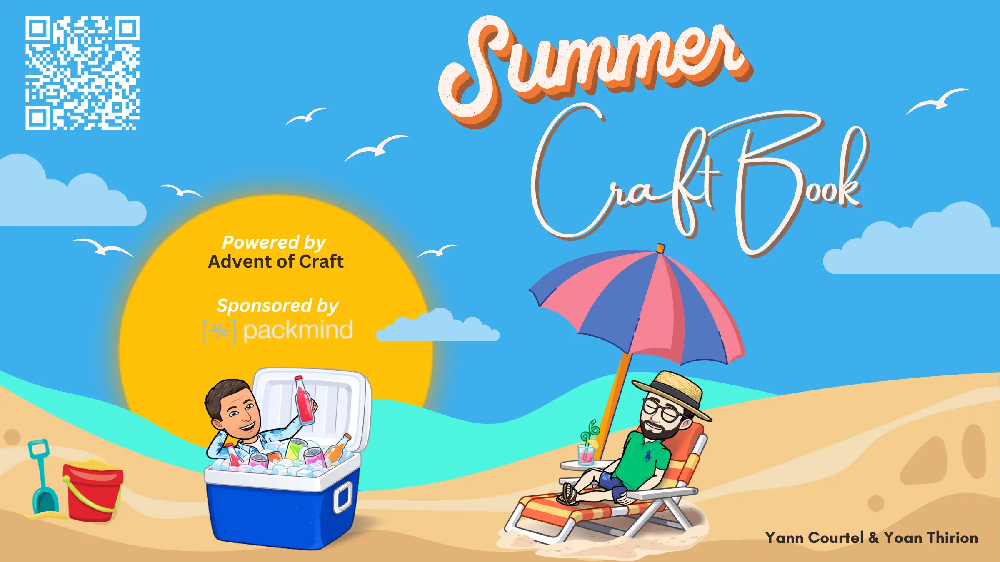
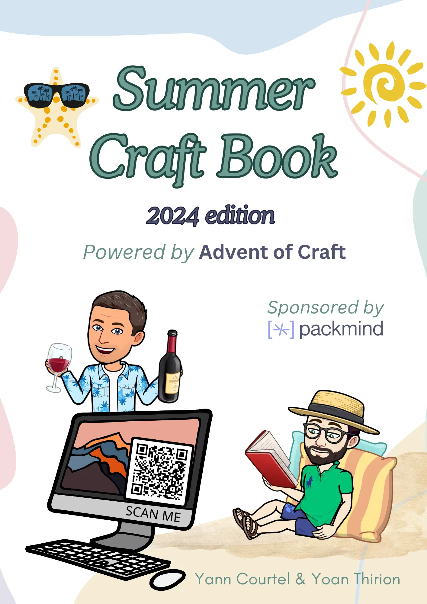
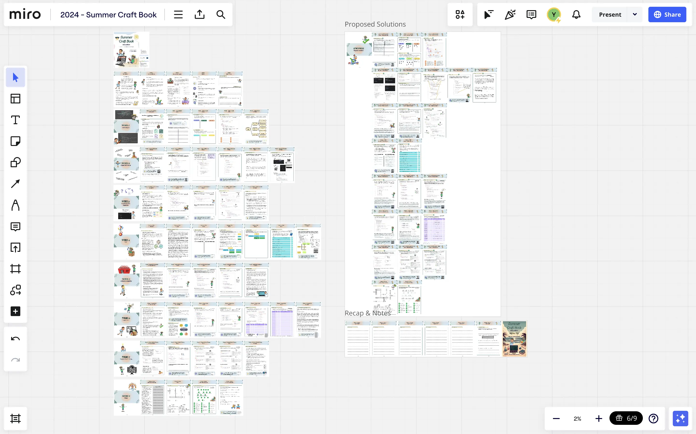
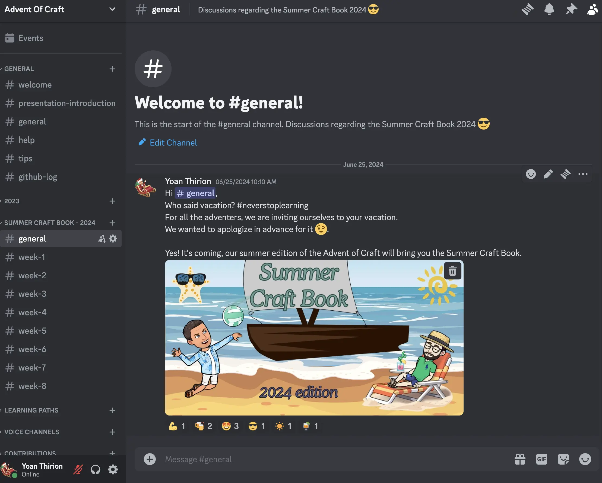

# Summer Craft Book 2024

This year, we are launching our version of the summer holiday workbook around `Software Craftsmanship` called the **Summer Craft Book**.

Please, download the PDF of the Summer Craft Book in this repository to get the most out of it.

## One theme a week

Each week, a specific theme is going to be examined. You will have information, theory,  exercises, games and resources to go further. 

Set aside a couple of hours a week to work on the subject. If you happen to have more time, a coding version will be available so you can dig into each exercise a bit longer.

We wouldn't want your craft skills to go to waste !

## About this repository

As with the Advent of Craft edition, the PDF of the Summer Craft Book comes with this github repository. Each exercise and most of the games are in it, so you could use the repository standalone.

We understand you could be busy in the summer and want to just do the practice so don't hesitate to do just that !

## The Book
You can grab your copy of our `Summer Craft Book` here:
- [Digital copy](https://drive.google.com/file/d/16BrF17jEMr6Sleonnq6xSafWMHA5_q1Y/view?usp=drive_link)
- [Printable version](https://drive.google.com/file/d/1yG6ALvJyf3y5LCWF38VlzW7D2APaGZRK/view?usp=sharing)

### Miro board
Alternatively, you can use the miro board template available [here](https://miro.com/app/board/uXjVK056f4o=/?share_link_id=201408685412) or by using the backup file available [here](https://drive.google.com/file/d/1laWnvAk8AnQ00QlaepzF3hTO2a8UR-Wg/view?usp=sharing).

## Summary
- [Week 1: Code Analysis.](/docs/01-code-analysis/week01.md)
- [Week 2: Object Calisthenics.](/docs/02-object-calisthenics/week02.md)
- [Week 3: Command Query Separation.](/docs/03-cqs/week03.md)
- [Week 4: Test Driven Development.](docs/04-tdd/week04.md)
- [Week 5: Accidental Complexity.](docs/05-complexity/week05.md)
- [Week 6: Legacy Code.](docs/06-legacy-code/week06.md)
- [Week 7: Property-based Testing.](docs/07-pbt/week07.md)

## Join us on Discord

To facilitate the communication and share your ideas around the different weeks, we invite you to join our `Discord` by simply clicking [here](https://discord.gg/E5Z9s9UKTS).

## Available languages
Here are the supported programming languages: `java`, `C#`, `kotlin`, `typescript`.