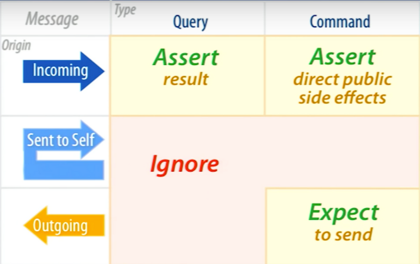

## Week 3: Command Query Separation.

### Defining the responsibilities

Whose responsibility is it?

In object-oriented programming (OOP), responsibility refers to the specific roles or behaviors assigned to an object. Each object in a system is responsible for managing its data and behaviors, known as methods, which interact with other objects. 

These behaviors or methods are identified as either commands or queries.

Commands change the state of the system.
Queries return information without altering the state. 

This distinction helps in designing predictable and reliable interactions within the system. The encapsulation of responsibility with the clear distinction between commands and queries ensures a modular, maintainable codebase.

> **A method is NOT supposed to do both.**

### How to assert properly

Assertions in unit testing insures the system is properly validated. It's important the assertions reflects the responsibility of the method and validates it accordingly. Look at the following graphic to help you assert correctly your code.

### Exercise 1: Identify the issue and its consequences

Please read the code well and try to understand the issue and the underlying bad consequences such a code can have.

>**Analyse the main issue and what changes you would make below.**

Correct the code to respect the CQS principle.

#### Supported languages

Choose your stack to do this exercise

- [Java](/exercise/java/week02-object-calisthenics/exercise1/)
- C# : ...
- ...

#### Proposed Solution

- [Java](/solution/java/week02-object-calisthenics/exercise1/)
- C# : ...
- ...

### Exercise 2: Double-edge method

Some methods can be both query & command and are especially hard to separate. Analyse the code below and see how you can refactor it to show the real intention. 

>**Try to write your unit tests and see the changes you want to emerge from them.**

#### Supported languages

Choose your stack to do this exercise

- [Java](/exercise/java/week03-cqs/exercise2/)
- C# : ...
- ...

#### Proposed Solution

- [Java](/solution/java/week03-cqs/exercise2/)
- C# : ...
- ...

